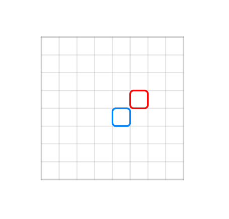
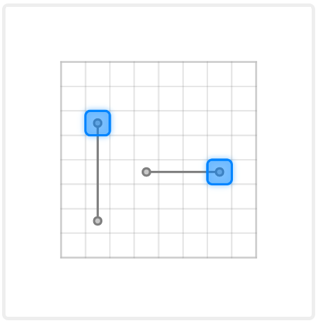
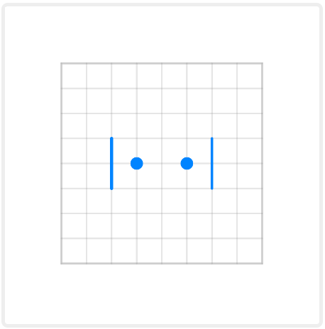
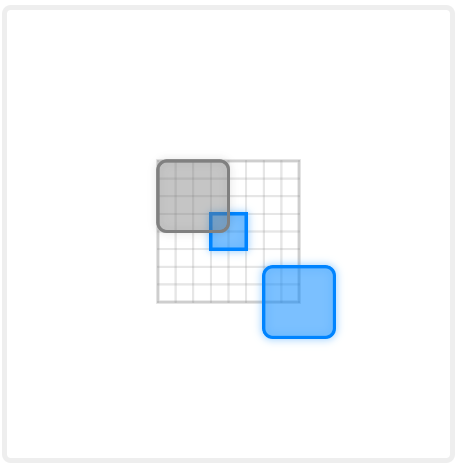
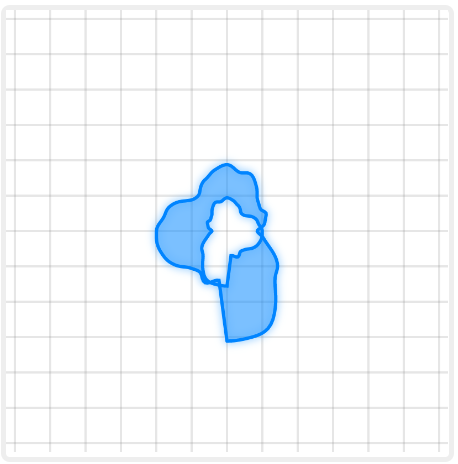

# camera-canvas-svelte

This is the package for creating simple p5 canvas in **Svelte** that has basic camera functionality build-in. With this you can draw different objects inside this environment with automatic screen coordinates to plane coordinates translation. This package also supports grid display as well as some mouse events capturing.

Basic usage:
```html
<script lang="ts">
  import Canvas from "camera-canvas-svelte";
  const update = (cx) => {
    cx.strokeWeight(3);
    cx.stroke(0, 132, 255);
    cx.rect(0, 0, 1, 1, 0.2);
    cx.stroke(255, 0, 0);
    cx.rect(1, -1, 1, 1, 0.2);
  }
</script>

<Canvas
  width={400}
  height={400}
  minX={-4}
  minY={-4}
  maxX={4}
  maxY={4}
  {update}
/>

```

As result we get following canvas: 



Camera can be setup with several parameters passed as props to Canvas component. Following properties are:
```ts
  width : number // width of the canvas
  height : number // height of the canvas
  X : number = 0 // sets initial X-position for camera
  Y : number = 0 // sets initial Y-position for camera
  minX : number = -1000 // sets left boundary for camera
  maxX : number = 1000 // sets right boundary for camera
  minY : number = -1000 // sets top boundary for camera
  maxY : number = 1000 // sets bottom boundary for camera
  hideBoundary : boolean = false // whether boundary won't be displayed

  update : (cx)=>any // function that will be called each frame
  init : (cx)=>any // function that will be called once after it's creation

  hideGrid : boolean = false // defines whether gird will be drawn on canvas
  gridSize : number = 32 // sets pixel equivalent to 1 unit in plane's space
  gridAutoResize : boolean = false // if set to true resizes grid while being zoomed-out to prevent it from filling the screen
  gridResizeFactor : number = 4 // number of cells that turns into new one, when resize happens
  minGridSize : number = 8 // if gridAutoResize = false, sets smallest unit of length between grid lines

  scale : number = 1 // determines grid scale (1 / n - zoom-out by n; n - zoom-in by n)
  minScale : number = 1 / 2 ** 4 // minimal scale allowed by zoom
  maxScale : number = 2 // maximal scale allowed by zoom

  backgroundColor : string | [number|number|number] = "#fff" // sets background color via string or three number array

  mouseClicked : (cx, PointerEvent) => any // function that will be called on left mouse click
  mousePressed : (cx, PointerEvent) => any // function that will be called on mouse press (and during it each frame)
  mouseReleased : (cx, PointerEvent) => any // function that will be called on mouse release
  rightMousePressed : (cx, PointerEvent) => any // as mousePressed but only for right button
  leftMousePressed : (cx, PointerEvent) => any // as mousePressed but only for right button

```

## Draw functions
Under it's hood this library implements functions of p5.js, which are modified and put into `cx` object which is passed into events, `update` and `init` methods. All the basic drawing functions from p5.js which can be found in [p5 documentation](https://p5js.org/reference/) were recreated to work with this grid system. The list of supported functions and their references on p5:

**2D Primitives**:
1. [arc()](https://p5js.org/reference/#/p5/arc)
2. [ellipse()](https://p5js.org/reference/#/p5/ellipse)
3. [circle()](https://p5js.org/reference/#/p5/circle)
4. [line()](https://p5js.org/reference/#/p5/line)
5. [point()](https://p5js.org/reference/#/p5/point)
6. [quad()](https://p5js.org/reference/#/p5/quad)
7. [rect()](https://p5js.org/reference/#/p5/rect)
8. [square()](https://p5js.org/reference/#/p5/square)
9. [triangle()](https://p5js.org/reference/#/p5/triangle)

**Curves**
1. [bezier()](https://p5js.org/reference/#/p5/bezier)
2. [bezierDetail()](https://p5js.org/reference/#/p5/bezierDetail)
3. [bezierPoint()](https://p5js.org/reference/#/p5/bezierPoint)
4. [bezierTangent()](https://p5js.org/reference/#/p5/bezierTangent)
5. [curve()](https://p5js.org/reference/#/p5/curve)
6. [curvePoint()](https://p5js.org/reference/#/p5/curvePoint)

**Vertex**
1. [beginContour()](https://p5js.org/reference/#/p5/beginContour)
2. [beginShape()](https://p5js.org/reference/#/p5/beginShape)
3. [bezierVertex()](https://p5js.org/reference/#/p5/bezierVertex)
4. [curveVertex()](https://p5js.org/reference/#/p5/curveVertex)
5. [endContour()](https://p5js.org/reference/#/p5/endContour)
6. [endShape()](https://p5js.org/reference/#/p5/endShape)
7. [quadraticVertex()](https://p5js.org/reference/#/p5/quadraticVertex)
8. [vertex()](https://p5js.org/reference/#/p5/vertex)

**Colors**
1. [color()](https://p5js.org/reference/#/p5/color)
2. [lerpColor()](https://p5js.org/reference/#/p5/lerpColor)
3. [fill()](https://p5js.org/reference/#/p5/fill)
4. [stroke()](https://p5js.org/reference/#/p5/stroke)
5. [noFill()](https://p5js.org/reference/#/p5/noFill)
6. [noStroke()](https://p5js.org/reference/#/p5/noStroke)
7. [background()](https://p5js.org/reference/#/p5/background) ! removes grid

**Noise**
1. [noise()](https://p5js.org/reference/#/p5/noise)
2. [noiseDetail()](https://p5js.org/reference/#/p5/noiseDetail)
3. [noiseSeed()](https://p5js.org/reference/#/p5/noiseSeed)

**Translate**
1. [translate()](https://p5js.org/reference/#/p5/translate)
2. [pop()](https://p5js.org/reference/#/p5/pop)
3. [push()](https://p5js.org/reference/#/p5/push)

In order to preserve rest of the functionality other p5 methods can be accessed through variable: `cx.p5`.

Some new functions present, that can be used to switch between coordinates:

```ts
uvx(x: number): number
uvy(y: number): number
```
After passing coordinate from the plane it will return coordinate on the screen relative to canvas center. For example, to get coordinate on screen where `(0, 0)` is you may use: `(cx.uvx(0), cx.uvy(0))`.

Output of this function relies on the position of the coordinate center. In case you need to transform relative sizes, you may consider using function `cx.uv(c : number) : number`. For example, you need to set stroke of the line to be 0.1 in plane space. Then you may use function `cx.strokeWeight(cx.uv(0.1))`. Otherwise, in case you use just `cx.strokeWeight(0.1)`, stroke size will be constant no matter how you zoom in or out.

Opposite transformation from the screen to coordinate space may be implemented with functions:
```ts
inx(x: number): number 
iny(y: number): number 
in(c: number): number
```
They will return coordinates transformed from coordinate on the screen to the coordinate on the plane. 

Some constants from p5 were implemented:
1. `POINTS`
2. `POINTS`
3. `LINES`
4. `TRIANGLES`
5. `TRIANGLE_FAN`
6. `TRIANGLE_STRIP`
7. `QUADS`
8. `QUAD_STRIP`
9. `CLOSE`
10. `PI`
11. `TAU`
12. `HPI`
13. `DEGREES`
14. `RADIANS`


And some new constants were added:
```ts
cx.mx : number
cx.my : number
// x and y coordinates of the mouse cursor on the plane
cx.mouseX : number
cx.mouseY : number
// x and y coordinates of the mouse cursor on the screen relative to canvas center

cx.mouseOutside : boolean
// returns true if the mouse outside of the canvas
```
## Other useful functions
Along side p5 functions this library implements new ones.
```ts
bound(x: number, min: number, max: number) : number
//returns value of x constrained by min and max values

bounded(x: number, min: number, max: number) : boolean
//checks if value x is between min and max values

region(
      x: number,
      y: number,
      minX: number,
      minY: number,
      maxX: number,
      maxY: number
    ): boolean 
//checks if value x in and y in [minX, maxY]x[minY, maxY] region

rectBounded(
      x: number,
      y: number,
      x0: number,
      y0: number,
      w: number,
      h: number
    ): boolean
//same as region, but uses top left corner coordinate (x0, y0), w - width and h - height to describe rectangular region

boundedMouseX(min: number, max: number): boolean
boundedMouseY(min: number, max: number): boolean
// check for mouse x and mouse y constrains

regionMouse(
      minX: number,
      minY: number,
      maxX: number,
      maxY: number
    ): boolean
// acts as region() for mouse x and y coordinates

rectMouse(x: number, y: number, w: number, h: number): boolean
//acts as rectBounded() for mouse x and y coordinates


distance(x1: number, y1: number, x2: number, y2: number): number
// return distance between (x1, y1) and (x2, y2)

distanceMouse(x: number, y: number): number
// returns distance between (x,y) and mouse position on plane
```

## Examples
### Click and translate
```ts
update=(cx) => {
  cx.strokeWeight(3);
  cx.setDash(5, 5);
  cx.stroke(128);
  cx.bezier(-1, -1.5, 0, -1.5, 0, 1.5, 1, 1.5);
  cx.stroke(0, 132, 255);
  cx.resetDash();
  cx.fill(0, 132, 255, 100);
  cx.setShadow(0, 0, 15, "#08f8");
  cx.rect(-2, -2, 0.9, 0.9, 0.2);
  cx.translate(3, 3); 
  cx.rect(-2, -2, 0.9, 0.9, 0.2);
}
doubleClicked= (e, cx) => {
  if (cx.rectMouse(-2, -2, 1, 1)) {
    alert("Rectangle 1 double-clicked");
  }
  if (cx.rectMouse(1, 1, 1, 1)) {
    alert("Rectangle 2 double-clicked");
  }
}
```

**Result:**


Here alert will be show if double click performed on one of the squares. `cx.translate` function shifts coordinates from (0, 0) to (3, 3), thus second rectangle is draw 3 grid units to left and 3 grid units to bottom relative to the first one.

### Mouse coordinates
```ts
update=(cx) => {
  cx.strokeWeight(3);
  cx.stroke(128);
  cx.line(-0.5, 0.5, 2.5, 0.5);
  cx.line(-2.5, -1.5, -2.5, 2.5);
  cx.fill(200);
  cx.circle(-0.5, 0.5, 0.3);
  cx.circle(2.5, 0.5, 0.3);
  cx.circle(-2.5, -1.5, 0.3);
  cx.circle(-2.5, 2.5, 0.3);
  cx.stroke(0, 132, 255);
  cx.fill(0, 132, 255, 100);
  cx.setShadow(0, 0, 15, "#08f8");
  cx.rect(cx.bound(cx.mx - 0.5, -1, 2), 0, 1, 1, 0.2);
  cx.rect(-3, cx.bound(cx.my - 0.5, -2, 2), 1, 1, 0.2);
}
```
**Result:**



Two rectangles are being bounded to mouseX and mouseY so that they move with mouse. `cx.bound` constrains value of mouse coordinate between two positions so that squares don't go out of border.

### Relative coordinates
```ts
update=(cx) => {
  cx.stroke(0, 132, 255);

  cx.strokeWeight(16);
  cx.point(-1, 0);
  cx.strokeWeight(4);
  cx.line(-2, -1, -2, 1);

  cx.strokeWeight(cx.uv(0.5));
  cx.point(1, 0);
  cx.strokeWeight(cx.uv(0.1));
  cx.line(2, -1, 2, 1);
}
```

**Result:**



Here two coordinates systems are being used to set size for line and point stroke. Regular one sets size unrelated to screen. After applying `cx.uv()` to the stroke weight on the right side, point's and line's stroke remains relative to zoom, so it's changes when you zoom in or out.

### Screen space draw
```ts
update=(cx) => {
  cx.stroke(0, 132, 255);
  cx.fill(0, 132, 255, 100);
  cx.setShadow(0, 0, 15, "#08f8");
  cx.rect(cx.inx(32), cx.iny(32), cx.in(64), cx.in(64), cx.in(8));
  cx.rect(-1, -1, 2, 2);
  cx.stroke(128);
  cx.setShadow(0, 0, 15, "#0002");
  cx.fill(128, 100);
  cx.p5.rect(-64, -64, 64, 64, 8);
}
```

**Result:**


Here we draw three rectangles using screen space through `cx.p5.rect` drawing function or through `cx.rect` applying coordinates transform before passing coordinates. As result two rectangles are drawn on screen and do not move or zoom with the plane, while regular rectangle `cx.rect(-1, -1, 2, 2)` stays bound to plane.

### Noise and shape
```ts
update=(cx) => {
  let t = cx.p5.frameCount / 60;
  cx.stroke(0, 132, 255);
  cx.fill(0, 132, 255, 100);
  cx.setShadow(0, 0, 15, "#08f8");
  cx.beginShape();
  cx.vertex(0, cx.noise(0, t) * 4);
  let n = Math.floor(cx.PI * 50);
  let d = 4;
  for (let i = 1; i < n - 3; i += 1) {
    let r = cx.noise((i / n) * d, t) * 4;
    let x = Math.sin((i / n) * cx.TAU) * r;
    let y = Math.cos((i / n) * cx.TAU) * r;
    cx.vertex(x, y);
  }
  cx.beginContour();
  cx.vertex(0, cx.noise(0, t) * 2);
  for (let i = 1; i < n - 3; i += 1) {
    let r = cx.noise((i / n) * d, t) * 2;
    let x = Math.sin(-(i / n) * cx.TAU) * r;
    let y = Math.cos(-(i / n) * cx.TAU) * r;
    cx.vertex(x, y);
  }
  cx.endContour();
  cx.endShape(cx.CLOSE);
}
```

**Result:**



Here you can see figure that changes over time as frameCount increases each second by 60. We use `cx.beginFigure()` to start drawing figure and then in the loop we define it's vertices. Than in that figure we start contour `cx.beginContour()` to cut-out inside of that shape. then we close contour and figure via `cx.endContour(); cx.endFigure()`. As result we get random figure with random shaped hole in it.
